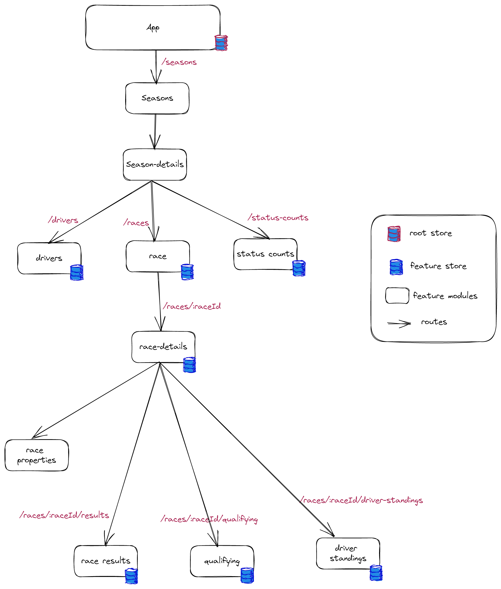

# F1 Race

An application to show F1 results from season 2018 through 2021.

## Deployment

The application is hosted and can be accessed using [this link](https://f1-race-czs43j3oq-sshastry-ks.vercel.app/)

## Demo

## App Structure

Based on the requirements to showcase F1 race related details, I came up with the following app structure.

## Few code design highlights

- The app uses  [NGRX](https://ngrx.io/) for state management (to embrace reactive thinking).
    - [@ngrx/entity](https://ngrx.io/guide/entity) for data collection management.
    - [@ngrx/router-store](https://ngrx.io/guide/router-store) for hydrating app route transitions data to the main store.
    - Division of application states across features by configuring feature stores.
    - Lean Angular components by off-loading state management to the NGRX store 
- All the routes are lazy-loaded and route accessibility to all the major features.
- Centralized API expection management using HTTP interceptor
- Uses [Angular Material](https://material.angular.io/components/categories) components and styling.

## TODOs

- Optimization of API calls especially wile loading `Race Details` by checking the availability of the required entity before hitting API
- Pagination enhancement. `Angular Material` `Paginator` component uses same event model to represent both `Page Change` and `Page Moved` events. This becomes a challenge to distinguish the events and make app react accordingly. 
- UX and style enhancements.

This project was generated with [Angular CLI](https://github.com/angular/angular-cli) version 15.0.5.

## Development server

Run `ng serve` for a dev server. Navigate to `http://localhost:4200/`. The application will automatically reload if you change any of the source files.

## Code scaffolding

Run `ng generate component component-name` to generate a new component. You can also use `ng generate directive|pipe|service|class|guard|interface|enum|module`.

## Build

Run `ng build` to build the project. The build artifacts will be stored in the `dist/` directory.

## Running unit tests

Run `ng test` to execute the unit tests via [Karma](https://karma-runner.github.io).

## Running end-to-end tests

Run `ng e2e` to execute the end-to-end tests via a platform of your choice. To use this command, you need to first add a package that implements end-to-end testing capabilities.

## Further help

To get more help on the Angular CLI use `ng help` or go check out the [Angular CLI Overview and Command Reference](https://angular.io/cli) page.
